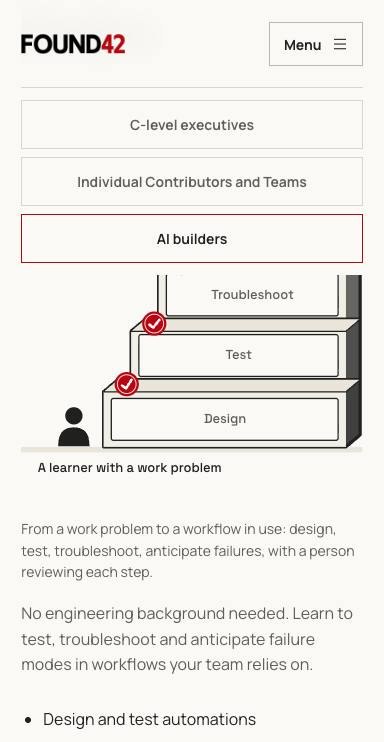
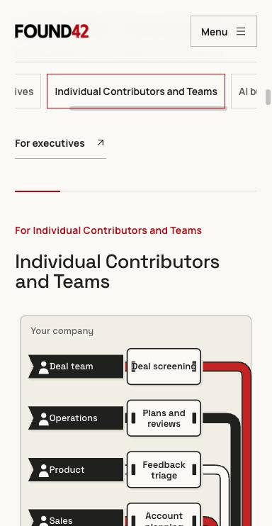
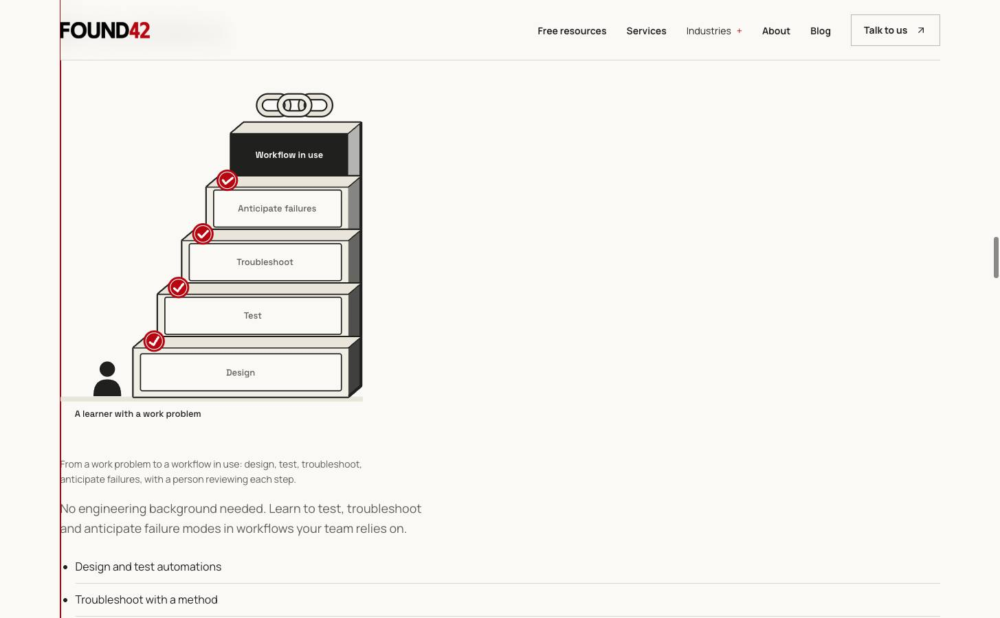
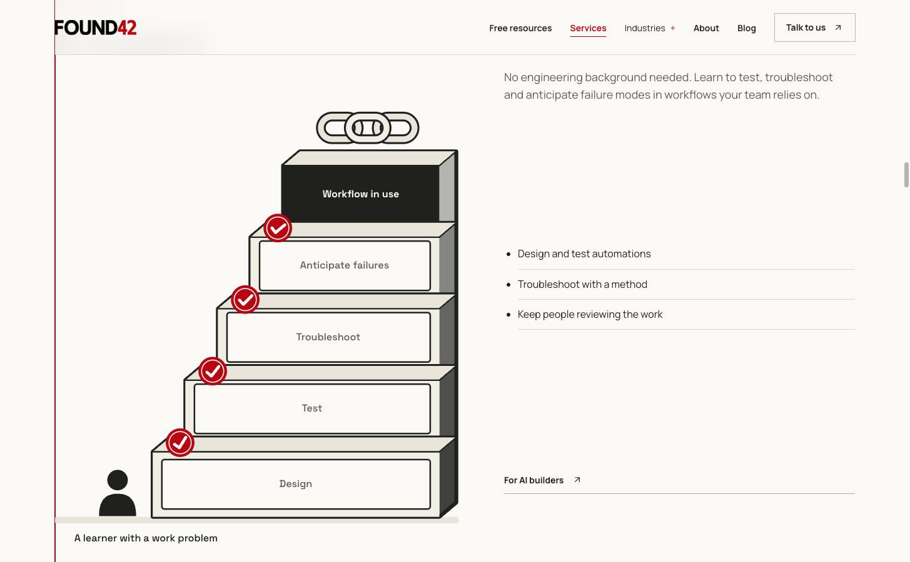

# Browser audit implementation evidence

Baseline: deployed GitHub Pages preview at `d9b1d4d`. After: local Vite preview
of `fix/browser-audit-findings`. Captures use isolated Chrome controlled by the
guarded Jev Ultrafast runner, with host allowlists and a 200-tick ceiling.

## Phone audience navigation

384 × 742, reduced motion. The shared audience rail changed from 163px to 57px,
leaving 106px more vertical reading space. The before capture shows the builder
selection on Home; the after shows the contributor selection on Services. These
routes share the same audience component. The full selected name fits, with
other choices accessible by horizontal scrolling or keyboard navigation.

## Desktop still-scene layout

1455 × 900, reduced motion, AI builders selected. Before on Home: portrait
figure above copy with empty space to its right. After on Services: the complete
portrait figure sits beside the explanatory copy. The shared component retains
its authored portrait composition so enlarged text remains legible.

These images are observed intermediate states, independently inspected. Some
Jev goals stopped early or continued into catalog content; a matching title or
the runner's verdict is not treated as proof of complete scenario coverage.
The automated browser suite supplies keyboard, no-script, download, base-path,
enlarged-text and cross-engine coverage.

## Review

### Standards

No documented-standard violations or actionable Fowler smell findings in
`d9b1d4d...830cf54`. A nonblocking reference to an unavailable Phase 1 template
was removed in `96f46f1`, leaving self-contained verification questions.

### Spec

No actionable spec defects in `d9b1d4d...830cf54`. The review independently
confirmed all four archives match the retrieved Drive files byte for byte,
the advisor context template is blank, and the selected essay paragraphs match
existing sources. A focused Chromium check confirmed selected audience names
remain visible and keyboard-operable at 320px with 200% text.

Standards: zero outstanding findings. Spec: zero outstanding findings.

The follow-up focus fix uses measured header height plus 16px scroller clearance.
A focused review found no standards or spec regressions. The regression check
passed three times per engine: 9/9 in Chromium, Firefox and WebKit. Before this
fix, the full local suite had 505 passing cases and one Firefox failure: the
advisor download box stopped at y=85.77 while the header ended at y=88.
Final CI status and its run link are recorded in the pull request.

## Automatic review follow-up

All seven initial Cubic findings were addressed: download checks now verify
original-source SHA-256 hashes, ZIP end and central-directory records, and
expected skill entries; dead unavailable-resource CSS and test selectors were
removed; the course-promise guard checks text; issue traceability was restored;
and the current site map and design documentation describe the delivered
resources and readable excerpts. All 15 affected browser checks passed across
Chromium, Firefox and WebKit with four workers. Lint, type checking, production
build and prerendering passed after this cleanup.
