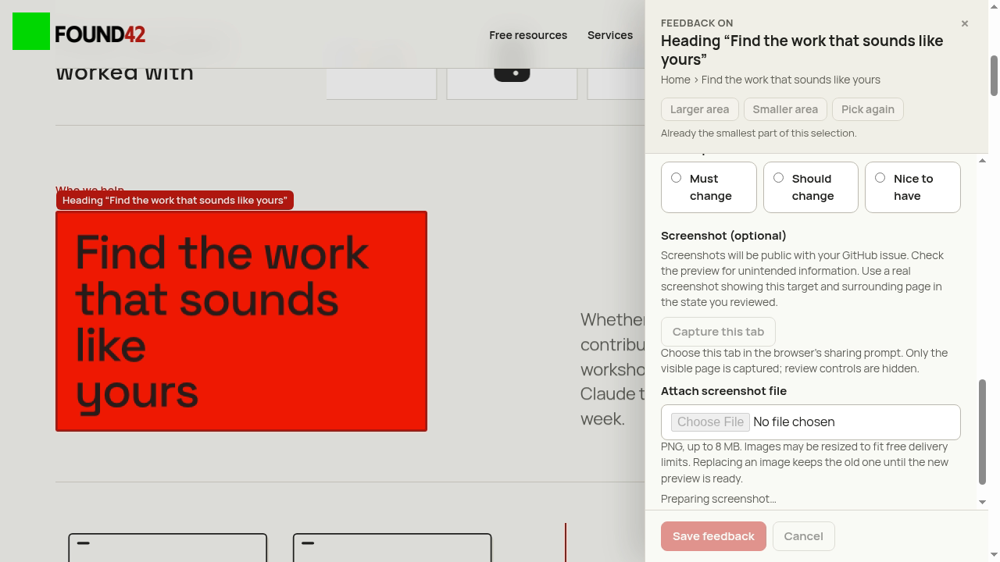

# Native tab capture diagnosis

The failing CI run [37000067020, attempt 1](https://github.com/nicolas-found42/website-redesign/actions/runs/37000067020/attempts/1) used `mcr.microsoft.com/playwright:v1.63.0-noble`, Node 22, and `xvfb-run -a npm test -- --workers=2 --shard=2/4`. The original capture test failed with red channel 238 (required >250).

The saved native image includes the feedback dialog, its backdrop, and the green control marker. It is a stale frame containing review controls, rather than an edge-sampling error. The 1280×720 viewport and image have a 1:1 scale. Heading bounds were x=71.046875, y=269.578125, width=475.515625, height=283.875. The existing formula samples target (83,281) and control (32,32).

| Measurement              | Failed CI capture            | Fixed Linux capture                    |
| ------------------------ | ---------------------------- | -------------------------------------- |
| Target RGBA at (83,281)  | 238,24,2,255                 | 255,26,1,255                           |
| Control RGBA at (32,32)  | 0,215,1,255                  | 249,250,245,255                        |
| 3×3 patch around target  | All nine pixels 238,24,2,255 | Original single-pixel assertion passes |
| Review controls/backdrop | Visible                      | Absent                                 |

The original failure is timing-dependent: a rerun of the same GitHub head passed, as did 20 focused baseline captures in the Linux image with two workers. A deterministic ordering regression at the production capture seam supplies queued video callbacks before page paint: before the fix, both callbacks observe zero page-paint ticks; after the fix, both observe two. Run `npx playwright test tests/review-capture.spec.ts --project=chromium --workers=2 --grep 'queued video'` (under `xvfb-run -a` on Linux).

The fix waits across a page paint boundary before requesting fresh native video frames, inside the existing five-second timeout. The genuine native capture test and its original single-pixel colour thresholds remain unchanged. Five repetitions of the complete capture spec in the Linux image passed all 25 tests using two workers. `after-samples.json` records the successful native sampling coordinates and pixels.
