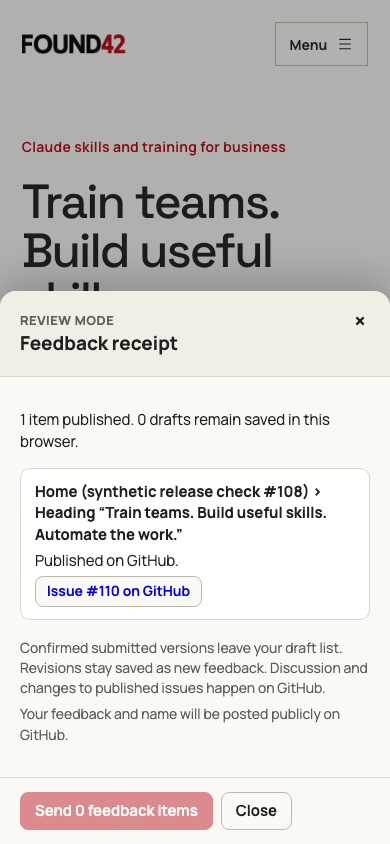

# Review submission evidence

Comparable Chromium captures use the same synthetic saved wording draft on the
home page, with reduced motion, at 1440 × 1000 and 390 × 844.

- **Before**: main commit `c3420032fc007f5638b5c98892a3aa41d22488ee`; Send opens
  the download/copy handoff.
- **After**: the #108 implementation; the bar shows the count and public notice,
  and one Send opens a receipt and removes the confirmed submitted draft.
- **Receipt boundary**: the service response is controlled locally. The issue
  link in these captures is a rendering fixture pointing to #108, not a newly
  created feedback issue. Live hosted verification is recorded separately in
  the implementation PR.

| Scenario      | Before                          | After                         |
| ------------- | ------------------------------- | ----------------------------- |
| Desktop draft | [Before](before-1440-draft.png) | [After](after-1440-draft.png) |
| Desktop Send  | [Before](before-1440-send.png)  | [After](after-1440-send.png)  |
| Phone draft   | [Before](before-390-draft.png)  | [After](after-390-draft.png)  |
| Phone Send    | [Before](before-390-send.png)   | [After](after-390-send.png)   |

Validation: `npm test -- --workers=4` passed all 563 tests across the three
browser engines and the unit/service project. The service tests use local D1
and controlled GitHub responses; routine tests create no live issues.

## First hosted attempt and recovery determination

The first synthetic attempt for ID `synthetic-release-108-20260930` entered
the durable `creating` state and returned pending. Cloudflare's native fetch
rejects `redirect: "error"` with a TypeError before making an outbound request;
a minimal local Worker-runtime probe reproduced that exact rejection. The
service's Node-hosted contract tests did not reject this option. The new test
bundles the actual Worker and exercises its default fetch through Miniflare,
with real D1 and a controlled outbound GitHub boundary.

The repaired Worker uses `redirect: "manual"`, which prevents credential
forwarding to a redirect destination. The runtime test now confirms one issue
creation and the identical cached receipt on retry. The initial attempt is
known to have failed before sending, so only this synthetic receipt may be
manually reset to ready while retaining its ID and fingerprint. This is a
documented recovery determination, not an automatic reset based on issue
absence; other ambiguous receipts remain pending.

The corrected live API check created
[issue #110](https://github.com/nicolas-found42/website-redesign/issues/110)
and returned the identical receipt on retry. Every field in the resulting JSON
record was compared to the submitted synthetic item; readable importance,
self-reported attribution, safe formatting, both labels and no assignee were
also verified. The synthetic issue was closed after inspection.
The request and both receipts are saved beside this document. Neither contains
credentials or real reviewer information.

After fixes, all 85 focused browser/service tests passed with `--workers=4`,
including actual bundled Worker execution through native fetch. The previous
full run passed 563 tests; the new tests add four cases. CI runs the final full
suite. Public Pages deployment remains dependent on merging the PR.

## Production build against the live service

A separate Chromium check at 390 × 844 served the PR's production assets under
the published site origin through a controlled browser route. It sent the same
already-confirmed synthetic ID to the real Worker, received the exact stored
issue #110 receipt, cleared only that submitted draft, and reopened the receipt after
reload. No new issue was created. Playwright was invoked with `--workers=4`;
the single release scenario passed. This verifies the built client and hosted
service together; it does not claim the PR's assets are deployed on Pages.

