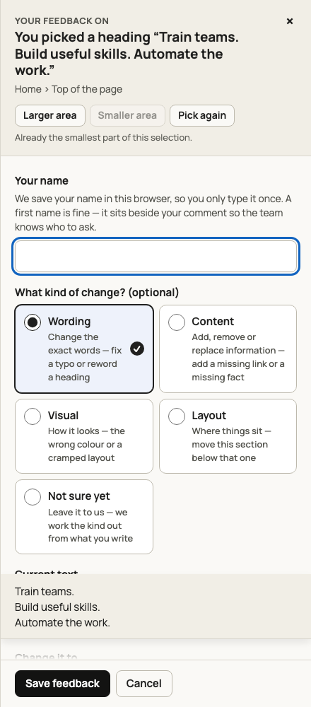
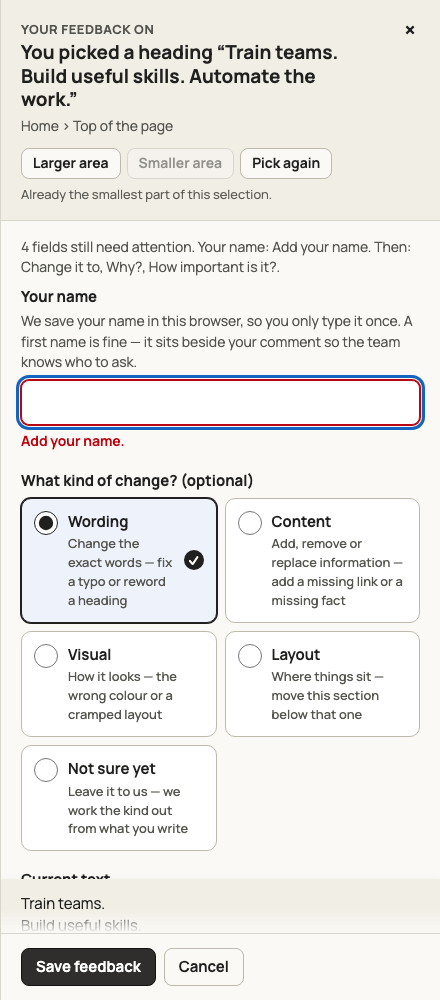
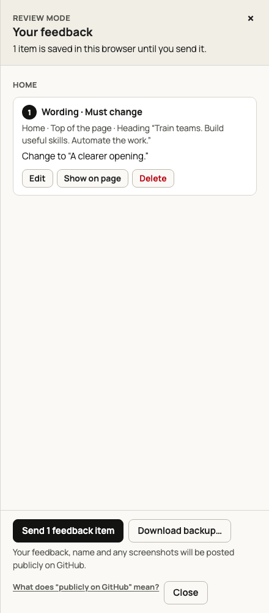

# Review visual audit

These are genuine browser captures of the review interface on a synthetic draft. The selected and invalid forms show the same Wording card and Save primary button. The invalid form additionally shows a red field boundary/error and a blue keyboard-focus ring. The saved-feedback list shows the red Delete action beside ink Edit/Show controls and the ink send primary.

| Selected and primary                                        | Invalid and focus                                           | Destructive action                                                       |
| ----------------------------------------------------------- | ----------------------------------------------------------- | ------------------------------------------------------------------------ |
|  |  |  |

Computed-style checks verify selection and Save use ink rather than red, focus uses `rgb(18, 100, 192)`, and invalid styling remains distinguishable. The [saved measurements](measurements.json) at 1280×1000 record Save at 134.72×38px, Cancel at 80.23×38px, their 8px gap, and the close target at 44×44px. Their labels and fill distinguish the adjacent actions; keyboard focus remains visible. Conditional helper text is measured in each rendered kind/action group against a 4.5:1 minimum.

The production form now owns the pinning and scroll-cue classes; the tests do not supply them. Visual-viewport resize tests at 360×640 and 390×844 simulate a keyboard reducing available height by 280px, verify Save/Cancel fit in that area, and verify recovery when available height returns. Actual software-keyboard verification on devices remains outstanding in #126; these tests do not claim that evidence.

Priority cards use one column. Geometry checks at 360, 390, and 1280px verify that every label clears its radio and selection checkmark. All 39 focused contrast, control-target, state, pinning/cue, priority, and simulated-keyboard checks passed across Chromium, Firefox, and WebKit with two workers after merging #155 into this branch.

The contrast audit also selects “Not sure yet,” checks that the “Your comment” field is visible, and attaches the saved native capture to measure the rendered caption/status helpers. This expanded audit passed in all three engines with two workers.
